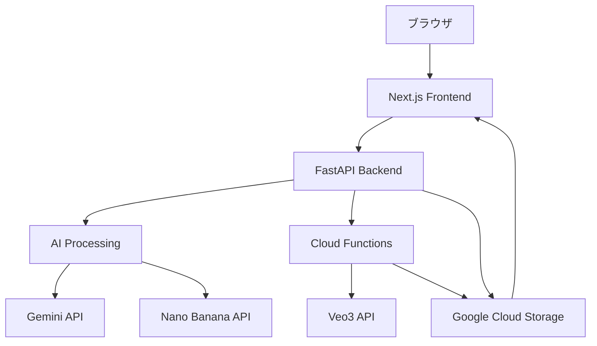
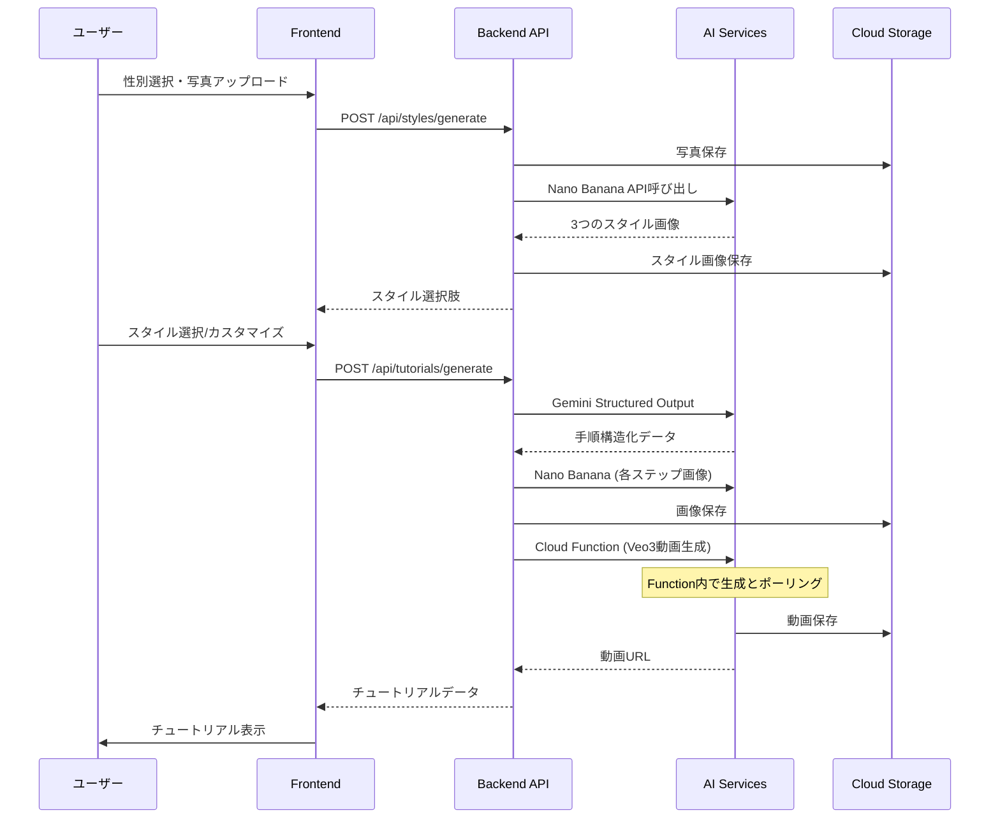
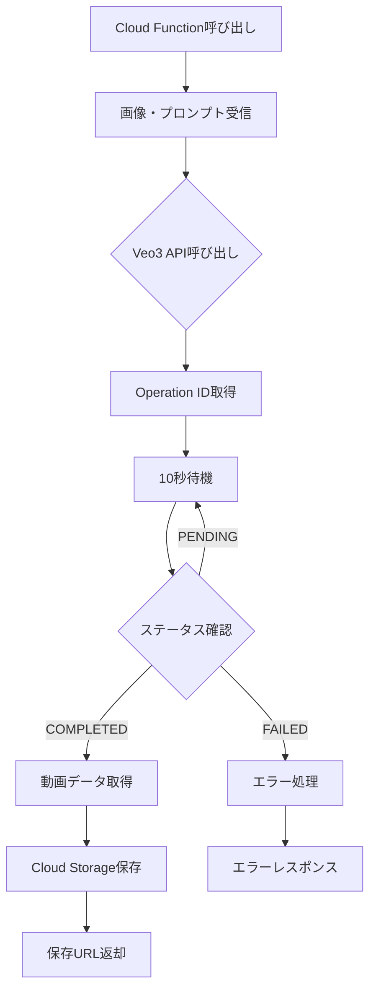

# Technical Design Document

## 概要

**目的**: Ejan（いーじゃん）は、ユーザーの顔写真から最適なメイクアップスタイル（ヘアスタイル＋メイク）を提案し、段階的なチュートリアルを提供するWebアプリケーションのMVP実装です。

**ユーザー**: メイクアップ初心者から上級者まで、性別を問わず自分に合ったスタイルを探している人々が、パーソナライズされたメイクアップ提案とチュートリアルを活用します。

**影響**: 既存のフロントエンドモック実装をベースに、バックエンドAPIとAI統合を追加することで、実際に動作するシステムへと変更します。

### ゴール
- ユーザーの顔写真から3つのメイクアップスタイルを自動生成
- 選択したスタイルに対する動画付きチュートリアルの提供
- エンドツーエンドの機能的なMVPデモの実現
- Cloud Storageによる生成コンテンツの永続化

### 非ゴール
- ユーザー認証・セッション管理の実装
- プロダクション環境向けのスケーリング機能
- レート制限やキューイング処理の実装
- 課金・決済機能の実装

## アーキテクチャ

### 既存アーキテクチャ分析

現在のシステムは以下の既存実装を持っています：
- **フロントエンド**: Next.js 14.2 App RouterによるUI実装（モックデータ使用）
- **コンポーネント**: shadcn/ui による50以上のUIコンポーネント
- **サンプルコード**: Nano BananaとVeo3のAPI統合サンプル
- **技術スタック**: TypeScript、React 18、Tailwind CSS、Python 3.11+

### ハイレベルアーキテクチャ



**アーキテクチャ統合**:
- 既存パターン保持: Next.js App Router、shadcn/ui コンポーネント構造
- 新コンポーネント根拠: FastAPI - 非同期処理とPythonベースAI統合のため
- Cloud Functions活用: Veo3動画生成の独立処理とタイムアウト管理
- 技術スタック整合: steering文書に定義された技術選択に準拠
- Steering準拠: microservices architecture、serverless functions原則を維持

### 技術整合性

本機能は既存の技術スタックと以下のように整合します：

**フロントエンド整合**:
- 既存のNext.js 14.2とReact 18構成を維持
- shadcn/uiコンポーネントライブラリを継続使用
- Tailwind CSSによるスタイリング方針を維持

**新規追加依存関係**:
- **google-genai**: Gemini/Nano Banana/Veo3 API統合
- **fastapi**: バックエンドAPI構築
- **uvicorn**: ASGI サーバー
- **google-cloud-storage**: メディアファイル管理

**主要設計決定**:

**決定1: AI処理のバックエンド統合**
- **コンテキスト**: AI API呼び出しには秘密鍵が必要で、フロントエンドから直接実行できない
- **選択肢**: Cloud Functions、バックエンドAPI統合、BFF(Backend for Frontend)パターン
- **選択したアプローチ**: FastAPIバックエンド内でAI処理を統合
- **根拠**: MVPとしてシンプルさを優先し、単一のバックエンドで全API処理を実行
- **トレードオフ**: 実装速度を優先し、スケーリング柔軟性を犠牲に

**決定2: Cloud Function内での動画生成完全処理**
- **コンテキスト**: Veo3動画生成は非同期で、完了まで約3分かかる
- **選択肢**: クライアントポーリング、バックエンドポーリング、Cloud Function内完結
- **選択したアプローチ**: Cloud Function内で10秒間隔ポーリングと保存まで実行
- **根拠**: 責務の明確化、単一関数での完結による実装の簡潔性
- **トレードオフ**: Function実行時間の増加を許容し、システムの単純性を優先

## システムフロー

### ユーザージャーニーシーケンス



### Cloud Function内動画生成フロー



## コンポーネントと インターフェース

### フロントエンドレイヤー

#### PhotoUploadコンポーネント

**責任と境界**
- **主要責任**: ユーザーの顔写真アップロードとバリデーション処理
- **ドメイン境界**: UIプレゼンテーション層
- **データ所有**: アップロード前の画像データ、性別選択情報
- **トランザクション境界**: 単一のHTTPリクエスト

**依存関係**
- **インバウンド**: Welcome Page、Gender Selection Page
- **アウトバウンド**: Backend API (/api/styles/generate)
- **外部**: なし

**サービスインターフェース**
```typescript
interface PhotoUploadService {
  uploadPhoto(
    photo: File,
    gender: 'male' | 'female' | 'neutral'
  ): Promise<Result<StyleOptions[], UploadError>>;

  validatePhoto(file: File): Result<boolean, ValidationError>;
}

type UploadError =
  | { type: 'FILE_TOO_LARGE'; maxSize: number }
  | { type: 'INVALID_FORMAT'; supportedFormats: string[] }
  | { type: 'NETWORK_ERROR'; message: string };
```

#### StyleSelectionコンポーネント

**責任と境界**
- **主要責任**: 生成されたスタイルの表示と選択処理
- **ドメイン境界**: UIプレゼンテーション層
- **データ所有**: 選択されたスタイル情報、カスタマイズテキスト

**APIコントラクト**
| Method | Endpoint | Request | Response | Errors |
|--------|----------|---------|----------|--------|
| GET | /api/styles/{id} | - | StyleDetail | 404, 500 |
| POST | /api/styles/{id}/customize | CustomizeRequest | StyleDetail | 400, 404, 500 |

### バックエンドレイヤー

#### StyleGenerationService

**責任と境界**
- **主要責任**: ユーザー写真からメイクアップスタイルを生成
- **ドメイン境界**: ビジネスロジック層
- **データ所有**: スタイル生成プロンプト、生成パラメータ
- **トランザクション境界**: 単一のスタイル生成セッション

**依存関係**
- **インバウンド**: StyleController (API Routes)
- **アウトバウンド**: Nano Banana API、Cloud Storage Service
- **外部**: google-genai ライブラリ

**外部依存調査**
- google-genai ライブラリバージョン: 最新版を使用
- 認証方法: GOOGLE_API_KEY環境変数
- レート制限: Nano Banana API - リクエスト制限なし（デモ環境）
- 画像生成コスト: $0.039/画像（3画像で$0.117）

**サービスインターフェース**
```typescript
interface StyleGenerationService {
  generateStyles(
    userPhoto: Buffer,
    gender: Gender,
    count: number = 3
  ): Promise<Result<GeneratedStyle[], GenerationError>>;

  getStylePrompts(gender: Gender): string[];
}

interface GeneratedStyle {
  id: string;
  title: string;
  description: string;
  imageUrl: string;
  prompt: string;
}
```

#### TutorialGenerationService

**責任と境界**
- **主要責任**: 選択されたスタイルから詳細なチュートリアルを生成
- **ドメイン境界**: ビジネスロジック層
- **データ所有**: チュートリアル構造、ステップ詳細情報

**依存関係**
- **インバウンド**: TutorialController (API Routes)
- **アウトバウンド**: Gemini API、Nano Banana API、VideoGenerationFunction
- **外部**: google-genai ライブラリ

**サービスインターフェース**
```typescript
interface TutorialGenerationService {
  generateTutorial(
    styleId: string,
    customization?: string
  ): Promise<Result<Tutorial, GenerationError>>;

  structureSteps(
    stylePrompt: string
  ): Promise<MakeupProcedure>;

  invokeVideoGeneration(
    imageUrl: string,
    prompt: string
  ): Promise<Result<string, VideoError>>;
}

interface Tutorial {
  id: string;
  title: string;
  description: string;
  totalSteps: number;
  steps: TutorialStep[];
}

interface TutorialStep {
  stepNumber: number;
  title: string;
  description: string;
  imageUrl: string;
  videoUrl: string;
  tools: string[];
}
```

### Cloud Functionレイヤー

#### VideoGenerationFunction

**責任と境界**
- **主要責任**: Veo3 APIを使用した動画生成、ポーリング、保存の完全処理
- **ドメイン境界**: インフラストラクチャ層（サーバーレス実行）
- **データ所有**: 動画生成ジョブの状態、生成された動画データ
- **トランザクション境界**: 単一の動画生成から保存までの完全プロセス

**依存関係**
- **インバウンド**: TutorialGenerationService (HTTP トリガー)
- **アウトバウンド**: Veo3 API、Google Cloud Storage
- **外部**: google-genai ライブラリ、google-cloud-storage ライブラリ

**Functionインターフェース**
```python
# Cloud Function Entry Point
def generate_video(request):
    """
    リクエスト:
    {
        "image_url": str,     # ステップ完成イメージURL
        "prompt": str,        # 動画生成プロンプト
        "step_number": int    # ステップ番号
    }

    レスポンス:
    {
        "video_url": str,     # Cloud Storage URL
        "duration": int,      # 処理時間（秒）
        "status": str         # "success" or "failed"
    }
    """
```
- **前提条件**: 有効な画像URLとプロンプト
- **事後条件**: 動画がCloud Storageに保存され、URLが返される
- **実行時間**: 最大540秒（Cloud Functions制限）

### ストレージレイヤー

#### CloudStorageService

**責任と境界**
- **主要責任**: 画像と動画ファイルの永続化と配信
- **ドメイン境界**: インフラストラクチャ層
- **データ所有**: メディアファイルのバイナリデータ

**依存関係**
- **インバウンド**: StyleGenerationService、TutorialGenerationService
- **アウトバウンド**: Google Cloud Storage
- **外部**: google-cloud-storage ライブラリ

**サービスインターフェース**
```typescript
interface CloudStorageService {
  uploadImage(
    buffer: Buffer,
    contentType: string
  ): Promise<Result<string, StorageError>>;

  uploadVideo(
    buffer: Buffer,
    contentType: string
  ): Promise<Result<string, StorageError>>;

  generateUniqueFileName(
    prefix: string,
    extension: string
  ): string;
}
```
- **前提条件**: 有効なGoogle Cloud認証情報
- **事後条件**: ファイルがCloud Storageに保存され、公開URLが返される
- **不変条件**: ファイル名の一意性が保証される

## データモデル

### ドメインモデル

**コア概念**:
- **集約**: Style（スタイル情報）、Tutorial（チュートリアル全体）
- **エンティティ**: GeneratedStyle、TutorialStep、UploadedPhoto
- **値オブジェクト**: Gender、CustomizationText、ToolList
- **ドメインイベント**: StyleGenerated、TutorialCreated、VideoProcessed

**ビジネスルールと不変条件**:
- スタイルは必ず3つ生成される
- 各チュートリアルステップには画像と動画が必須
- ファイルサイズは10MB以下
- 動画は10秒の長さ

### APIデータ転送

**スタイル生成リクエスト/レスポンス**:
```typescript
// Request
interface GenerateStylesRequest {
  photo: string; // Base64エンコード
  gender: 'male' | 'female' | 'neutral';
}

// Response
interface GenerateStylesResponse {
  styles: Array<{
    id: string;
    title: string;
    description: string;
    imageUrl: string;
  }>;
}
```

**チュートリアル生成リクエスト/レスポンス**:
```typescript
// Request
interface GenerateTutorialRequest {
  styleId: string;
  customization?: string;
}

// Response (Gemini Structured Output)
interface MakeupProcedure {
  title: string;
  description: string;
  requiredTools: string[];
  steps: Array<{
    stepNumber: number;
    title: string;
    description: string;
    detailedInstructions: string;
    toolsNeeded: string[];
  }>;
}
```

**動画生成ステータス**:
```typescript
interface VideoGenerationStatus {
  operationId: string;
  status: 'PENDING' | 'PROCESSING' | 'COMPLETED' | 'FAILED';
  videoUrl?: string;
  error?: string;
}
```

## エラーハンドリング

### エラー戦略

各エラータイプに対する具体的な処理とリカバリメカニズムを実装します。

### エラーカテゴリとレスポンス

**ユーザーエラー (4xx)**:
- 画像サイズ超過 → ファイルサイズ制限メッセージと圧縮ガイド
- サポート外フォーマット → 対応フォーマット一覧表示
- 必須フィールド欠如 → フィールドレベルバリデーション

**システムエラー (5xx)**:
- AI API失敗 → 自動リトライ（最大3回）後、フォールバック
- タイムアウト → 処理継続＆ポーリング増加
- Storage失敗 → エラーログ記録＆手動リトライオプション

**ビジネスロジックエラー (422)**:
- スタイル生成失敗 → 別プロンプトで再試行
- 動画生成失敗 → 画像のみのチュートリアル提供

### モニタリング

- console.error()によるエラーロギング（開発環境）
- Cloud Loggingへのエラー送信（将来実装）

## テスト戦略

### ユニットテスト
- PhotoUploadService: ファイルバリデーション、サイズチェック
- StyleGenerationService: プロンプト生成、レスポンス解析
- CloudStorageService: ファイル名生成、アップロード処理
- TutorialGenerationService: ステップ構造化、ポーリングロジック

### 統合テスト
- フロントエンド→バックエンドAPI: スタイル生成フロー全体
- バックエンド→AI APIs: Nano Banana/Veo3/Gemini呼び出し
- バックエンド→Cloud Storage: ファイルアップロード/取得
- ポーリング処理: 動画生成待機とステータス更新

### E2Eテスト
- 写真アップロード→スタイル選択→チュートリアル表示の完全フロー
- エラー処理フロー: API失敗時の適切なメッセージ表示
- カスタマイズフロー: カスタマイズテキスト反映確認

## セキュリティ考慮事項

### API セキュリティ
- **CORS設定**: フロントエンドドメインのみ許可
- **APIキー管理**: 環境変数での管理、フロントエンドへの露出防止
- **サービスアカウント**: 最小権限原則（Storage書き込みのみ）

### データプライバシー
- **ユーザーデータ**: セッション終了後も保持（デモ環境）
- **個人情報**: 顔写真の扱いに関する注意事項表示
- **GDPR/プライバシー**: 未実装（デモ環境のため）

### 入力検証
- ファイルタイプ検証（JPEG、PNG、WebPのみ）
- ファイルサイズ制限（10MB）
- カスタマイズテキスト長制限（500文字）