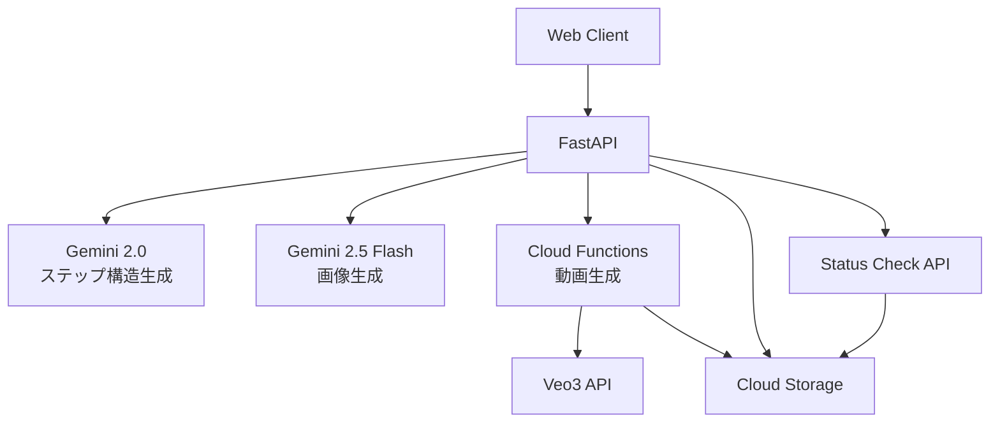

# チュートリアル生成API実装計画

## 概要
EJANプラットフォームのチュートリアル生成機能を実装します。ユーザーが入力した説明文（rawDescription）から、AIを活用して段階的なメイクアップチュートリアルを生成し、各ステップの完成イメージ画像と指導動画を作成します。

## システムアーキテクチャ



## APIエンドポイント

### 1. POST /api/tutorials/generate
チュートリアル生成のメインエンドポイント

**リクエスト:**
```json
{
  "rawDescription": "ナチュラルメイクで清楚な印象に...",
  "originalImageUrl": "https://storage.googleapis.com/..."
}
```

**レスポンス:**
```json
{
  "id": "tutorial_abc123",
  "title": "ナチュラルメイクチュートリアル",
  "description": "清楚な印象を作る5ステップ",
  "totalSteps": 5,
  "steps": [
    {
      "stepNumber": 1,
      "title": "ベースメイク",
      "description": "肌を整える",
      "imageUrl": "https://storage.googleapis.com/...",
      "videoUrl": null,  // 初期はnull、非同期で生成
      "tools": ["ファンデーション", "コンシーラー"]
    }
  ]
}
```

### 2. GET /api/tutorials/{tutorialId}/status
チュートリアルの生成状況確認

**レスポンス:**
```json
{
  "tutorialId": "tutorial_abc123",
  "status": "processing",
  "progress": 60,
  "steps": [
    {
      "stepNumber": 1,
      "status": "completed",
      "videoUrl": "https://storage.googleapis.com/..."
    },
    {
      "stepNumber": 2,
      "status": "processing",
      "videoUrl": null
    }
  ]
}
```

## 処理フロー

### Phase 1: ステップ構造の生成
1. rawDescriptionを受け取る
2. Gemini 2.0-flash-liteを使用してステップ構造を生成
3. 各ステップのtitle、description、必要なツールを定義

### Phase 2: 画像生成（順次処理）
各ステップについて順番に処理:
1. **入力画像の準備**
   - ステップ1: オリジナル画像を使用
   - ステップ2以降: 前ステップの完成画像を使用

2. **完成イメージ生成**
   - Gemini 2.5 Flash Image Preview（nano banana）使用
   - 入力: 前画像 + title + description
   - 出力: そのステップの完成イメージ

### Phase 3: 動画生成（非同期処理）
各ステップについて:
1. Cloud Functionsに動画生成リクエスト
   - 入力画像: 前ステップの完成画像（ステップ1はオリジナル）
   - 指示テキスト: そのステップのdescription
   - 保存先パス: `tutorials/{tutorialId}/step_{stepNumber}/video.mp4`

2. Cloud Functions内でVeo3 APIを使用して動画生成
3. 指定されたGCSパスに保存

### Phase 4: ステータス確認
1. クライアントが定期的にstatusエンドポイントを呼び出し
2. GCS上の動画ファイル存在を確認
3. 全ステップの動画が揃ったら完了

## データモデル

### TutorialGenerationRequest（拡張）
```python
class TutorialGenerationRequest(BaseModel):
    raw_description: str = Field(
        ...,
        max_length=5000,
        description="チュートリアルの説明文",
        alias="rawDescription"
    )
    original_image_url: str = Field(
        ...,
        description="オリジナル画像のURL",
        alias="originalImageUrl"
    )
```

### TutorialStatus
```python
class StepStatus(str, Enum):
    PENDING = "pending"
    PROCESSING = "processing"
    COMPLETED = "completed"
    FAILED = "failed"

class TutorialStatusResponse(BaseModel):
    tutorial_id: str
    status: str  # processing, completed, failed
    progress: int  # 0-100
    steps: List[StepStatusInfo]
```

## 技術仕様

### AI モデル
- **ステップ構造生成**: Gemini 2.0-flash-lite
- **画像生成**: Gemini 2.5-flash-image-preview (nano banana)
- **動画生成**: Veo3 (via Cloud Functions)

### ストレージ構造
```
tutorials/
  {tutorialId}/
    metadata.json          # チュートリアルメタデータ
    original.jpg          # オリジナル画像
    step_1/
      image.jpg          # 完成イメージ
      video.mp4          # 指導動画
    step_2/
      image.jpg
      video.mp4
    ...
```

### エラーハンドリング
- 各ステップでエラーが発生しても、他のステップは継続
- リトライロジックの実装（最大3回）
- 部分的な成功でも結果を返す

### パフォーマンス考慮
- 画像生成は順次処理（前画像が必要なため）
- 動画生成は非同期処理（Cloud Functions経由）
- ステータス確認はポーリング方式
- タイムアウト: 画像生成30秒、動画生成10分

## セキュリティ
- 入力値のバリデーション
- URLの検証
- ファイルサイズ制限
- レート制限の実装

## 今後の拡張
- WebSocketによるリアルタイム進捗通知
- 生成済みチュートリアルのキャッシュ
- カスタマイズオプションの追加
- 多言語対応